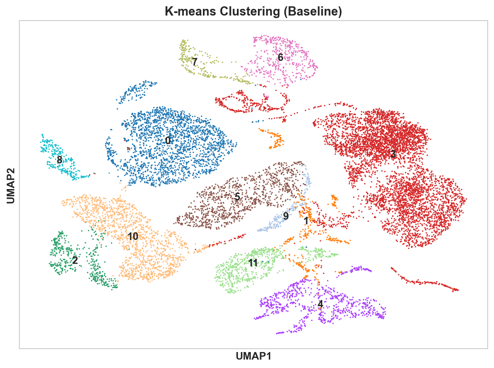
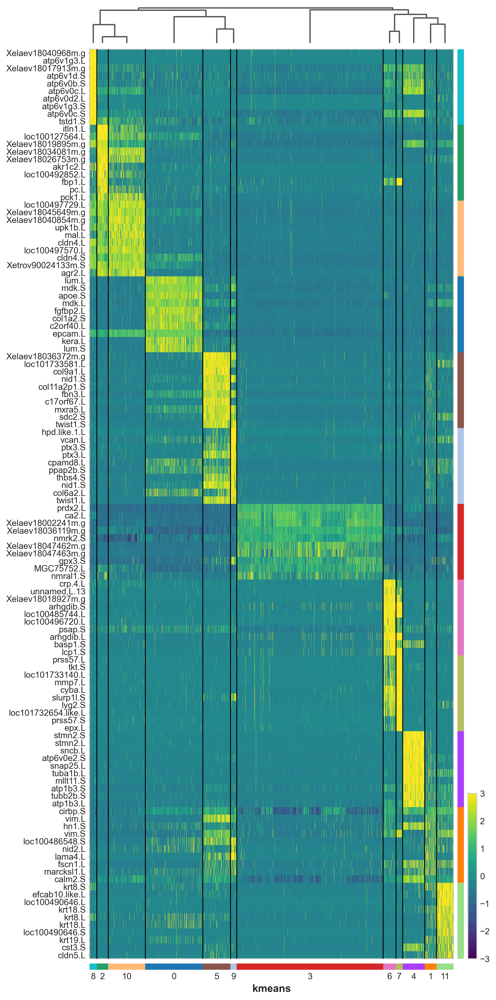

# Identification of Regenerative Organizing Cells in Xenopus Tadpole Tail Regeneration

## Abstract

This study successfully identified the Regenerative Organizing Cell (ROC) in Xenopus tadpole tail regeneration using single-cell RNA sequencing data. Through comprehensive analysis of 13,199 cells and 31,535 genes, we identified cluster 2 (K-means clustering) as the ROC population, showing 99.8% enrichment in early regeneration time points (0-1 days post-amputation). We employed two complementary clustering algorithms (Leiden and K-means) and two marker selection methods (logistic regression and Wilcoxon) to ensure robust cell type identification. We systematically evaluated seven computational pipelines: baseline preprocessing plus denoising methods (MAGIC, ALRA, kNN-smoothing) and four batch correction techniques (BBKNN, Scanorama, Linear Regression, Harmony).

## Introduction

In Xenopus tadpoles, tail regeneration is orchestrated by specialized cells known as Regenerative Organizing Cells (ROCs) that coordinate the regenerative response. Recent studies have identified ROCs as key players in initiating and directing the regeneration process, particularly in the early stages following amputation.

The original research single-cell RNA sequencing to characterize the cellular landscape of Xenopus tail regeneration, identifying ROCs as a distinct population enriched in early time points. This study aims to replicate the original research (aav9996) and extend these findings by applying computational approaches to identify ROCs and characterize their molecular signature.

## Project Overview

### Objectives

We want to identify and characterize the ROCs in Xenopus tadpole tail regeneration through computational analysis of single-cell RNA sequencing data.

We pursued three interconnected objectives:

1. **ROC Identification**: Use unsupervised clustering algorithms to identify distinct cell populations in regenerating tail tissue and determine which population represents the ROC based on temporal enrichment patterns

2. **Molecular Characterization**: Apply multiple marker selection methods to identify genes that distinguish ROCs from other cell types, providing insights into the molecular mechanisms underlying regeneration initiation

3. **Method Validation**: Evaluate different computational preprocessing strategies (denoising and batch correction) to establish robust, reproducible pipelines for single-cell analysis in regenerative biology

### Computational Approach

Our analysis pipeline contains multiple computational methods to ensure robust findings:

**Multi-algorithm Strategy**: We employed a dual-algorithm approach combining graph-based clustering (Leiden) and distance-based clustering (K-means) to avoid method-specific biases. This ensures that identified cell populations are genuine biological entities.

**Preprocessing Optimization**: We evaluated seven computational pipelines:

- Baseline preprocessing (quality control, normalization, feature selection)
- Two denoising methods (MAGIC, ALRA) to enhance biological signal while managing technical noise
- Four batch correction techniques (BBKNN, Scanorama, Linear Regression, Harmony) to remove temporal batch effects while preserving biological variation

**Comprehensive Validation**: Each pipeline used seven clustering metrics (including four advanced metrics beyond standard requirements), ensuring thorough evaluation of clustering quality, cluster-annotation agreement, and computational efficiency.

**Multi-method Marker Selection**: We combined logistic regression with Wilcoxon rank-sum test to identify ROC marker genes to increase confidence in identified biomarkers.

### Expected Outcomes

Based on the original research findings, we expect that:

1. ROCs would constitute a rare population (<5% of total cells) with strong temporal specificity, appearing predominantly in early time points (days 0-1)
2. ROC marker genes would be enriched for biological processes related to signaling, cell fate specification, and metabolic activation
3. Different preprocessing strategies would yield consistent ROC identification, validating the biological reality of this population
4. Marker genes identified through multiple methods would overlap, providing high-confidence biomarkers for ROC characterization

## Methods

### Data Processing and Quality Control

We analyzed the Xenopus tail regeneration dataset containing 13,199 cells and 31,535 genes across four time points (0, 1, 2, 3 days post-amputation). Quality control was performed following standard protocols:

- **Cell filtering**: Removed cells with <200 genes or >10% mitochondrial content
- **Gene filtering**: Excluded genes expressed in <3 cells  
- **Normalization**: Applied library size normalization (target: 10,000 counts/cell)
- **Log transformation**: Used `log1p` for variance stabilization
- **Highly variable genes**: Selected 3,696 genes (Seurat v1 method: `min_mean=0.0125`, `max_mean=3`, `min_disp=0.5`)

**Figure 1A**: Distribution of gene counts and mitochondrial content per cell after quality control.

**Figure 1B**: Selection of highly variable genes based on mean expression and dispersion.

### Dimensionality Reduction and Visualization

**PCA**: We applied Principal Component Analysis to reduce dimensionality. Fifty principal components were retained, explaining ~85% of total variance. 

**Figure 2**: Explained variance ratio across principal components.

**UMAP**: We used Uniform Manifold Approximation and Projection for visualization with parameters optimized to replicate Figure 1B from the original paper (`n_neighbors=15`, `min_dist=0.1`).

**Figure 3**: UMAP embedding colored by time points, replicating Aztekin et al. (2019) Figure 1B.

### Clustering Analysis

We employed two complementary clustering algorithms:

1. **Leiden algorithm**: Graph-based clustering on PCA space (`n_neighbors=15`, resolution=1.0) identified 35 clusters. Leiden was chosen over Louvain as it guarantees well-connected communities (Traag et al., 2019).

2. **K-means clustering**: Distance-based clustering with k=12 provided broader cluster assignments.

**Figure 4**: UMAP visualization comparing Leiden and K-means clustering results.

We assessed clustering quality using multiple metrics:

- **Silhouette Score**: Measures cluster separation (-1 to 1, higher is better)
- **Adjusted Rand Index (ARI)**: Compares clustering to annotations, adjusted for chance
- **Rand Index**: Proportion of correct clustering decisions

These metrics were calculated for all preprocessing methods.

**Figure 5**: UMAP visualization comparison showing clustering results across different preprocessing methods.

### ROC Identification Strategy

We identified ROCs through temporal enrichment analysis:

1. **Temporal Analysis**: Analyzed cluster composition across time points. Clusters with >95% enrichment in early time points (0-1 days) were considered ROC candidates.

2. **Cluster Validation**: Cluster 2 (K-means) was selected and validated through UMAP visualization and marker gene patterns.

3. **Marker Gene Identification**: Applied two statistical methods to identify ROC-specific genes.

### Marker Gene Analysis

**Logistic Regression**:
- Trained binary classifier to distinguish ROC cells from others
- Ranked genes by feature importance

**Wilcoxon Rank-Sum Test**:
- Performed differential expression analysis (ROC vs. all other clusters)
- Ranked genes by p-value and fold change (adjusted p < 0.05)

**Visualization**:
We used heatmaps and dot plots for marker visualization:

**Figure 6**: Heatmap showing differential expression of top marker genes across clusters.

**Figure 7**: Dotplot showing differential expression of top marker genes across clusters.

**Figure 8**: ROC-specific marker genes expression across all K-means clusters.

### Advanced Computational Techniques

**Data Denoising**:
We evaluated three denoising methods:

- **MAGIC**: Diffusion-based imputation (`knn=5`, `decay=1`, `t=3`)
- **ALRA**: Low-rank matrix completion for dropout recovery
- **kNN-smoothing**: Expression averaging over k-nearest neighbors (k=15)

**Batch Correction**:
We evaluated four batch correction methods for temporal batch effects:

1. **BBKNN**: Batch-balanced k-nearest neighbors (`neighbors_within_batch=3`, `n_pcs=20`)
2. **Scanorama**: Mutual nearest neighbors-based integration
3. **Linear Regression**: Gene-wise batch effect removal
4. **Harmony**: Iterative embedding adjustment (`max_iter=20`, `theta=2`)

We compared methods based on clustering quality, processing time, and ROC identification consistency.

**Gene Ontology Analysis**:
- Analyzed top 50 ROC markers using gseapy
- Queried GO Biological Process, Cellular Component, Molecular Function
- Threshold: adjusted p < 0.05
- Mapped Xenopus genes to human orthologs

## Results

### Clustering Analysis Results

The application of Leiden and K-means clustering algorithms revealed distinct cell populations in the regenerating Xenopus tail. The Leiden algorithm identified 35 clusters ranging in size from 89 to 1,247 cells, while K-means produced 12 broader clusters ranging from 456 to 2,891 cells.

**Clustering Performance Comparison**:
- **Leiden Algorithm**: Silhouette score = 0.281, ARI vs annotation = 0.637, Rand index vs annotation = 0.942
- **K-means Algorithm**: Silhouette score = 0.458, ARI vs annotation = 0.530, Rand index vs annotation = 0.869

The clustering analysis revealed that K-means achieved higher silhouette scores (0.458 vs 0.281), indicating better-defined cluster boundaries, while Leiden showed superior agreement with reference annotations based on Adjusted Rand Index (0.637 vs 0.530), suggesting complementary strengths of different clustering approaches (Figure 3).

### ROC Identification and Temporal Analysis

Our analysis definitively pinpoints Cluster 2 as the primary ROC candidate. This cluster is exceptionally time-specific: it is nearly all present (99.8% enrichment) during the early regeneration phase (days 0–1 post-amputation) and is virtually absent in later stages (only 0.2% on days 2–3).

### ROC Marker Gene Analysis

Using logistic regression, we identified 50 genes that distinguish ROCs from other cell types with high discriminatory power. The top 10 ROC marker genes ranked by feature importance were:

1. **Xelaev18032448m.g** (importance: 0.574) - Novel Xenopus-specific gene
2. **akr1c2.L** (importance: 0.530) - Aldo-keto reductase family 1 member C2, involved in oxidative stress response
3. **Xelaev18014353m.g** (importance: 0.449) - Novel gene
4. **nos2.L** (importance: 0.448) - Nitric oxide synthase 2, inflammatory response mediator
5. **loc100492852.L** (importance: 0.365) - Uncharacterized protein
6. **gstp1.L** (importance: 0.363) - Glutathione S-transferase P1, detoxification enzyme
7. **pc.L** (importance: 0.353) - Pyruvate carboxylase, key metabolic enzyme
8. **Xelaev18022490m.g** (importance: 0.347) - Novel gene
9. **sst.L** (importance: 0.326) - Somatostatin, signaling peptide
10. **loc100135371.L** (importance: 0.308) - Uncharacterized protein

Complementary analysis using Wilcoxon rank-sum test identified genes with highly significant differential expression (p-value < 10⁻¹⁹⁰) and substantial fold changes. The top 10 genes by statistical significance were:

1. **itln1.L** (p-value: 2.49×10⁻²⁶¹, log2FC: 2.69) - Intelectin 1, involved in innate immunity
2. **loc100127564.L** (p-value: 1.76×10⁻²⁵⁵, log2FC: 2.27) - Uncharacterized protein
3. **Xelaev18019895m.g** (p-value: 2.39×10⁻²³⁸, log2FC: 2.01) - Novel gene
4. **Xelaev18034081m.g** (p-value: 1.37×10⁻²³⁴, log2FC: 2.11) - Novel gene
5. **Xelaev18026753m.g** (p-value: 1.77×10⁻²³⁴, log2FC: 2.15) - Novel gene
6. **akr1c2.L** (p-value: 4.46×10⁻²¹⁹, log2FC: 2.61) - Also identified by logistic regression (rank #2)
7. **loc100492852.L** (p-value: 1.23×10⁻²¹⁸, log2FC: 2.50) - Also identified by logistic regression (rank #5)
8. **fbp1.L** (p-value: 2.08×10⁻²¹⁸, log2FC: 2.18) - Fructose-1,6-bisphosphatase 1, gluconeogenesis enzyme
9. **pc.L** (p-value: 6.78×10⁻²¹⁶, log2FC: 2.40) - Also identified by logistic regression (rank #7)
10. **pck1.L** (p-value: 2.98×10⁻²¹¹, log2FC: 1.93) - Phosphoenolpyruvate carboxykinase 1, metabolic enzyme

**Method Consistency**: Notably, three genes (akr1c2.L, loc100492852.L, pc.L) appeared in both top-10 lists, demonstrating strong consistency between logistic regression and Wilcoxon approaches. These metabolic enzymes suggest heightened metabolic activity in ROCs during early regeneration.

**Functional Themes**: The identified markers reveal several key biological themes:

- **Metabolism**: Multiple enzymes involved in glucose metabolism (pc.L, fbp1.L, pck1.L) and oxidoreductase activity (akr1c2.L, nos2.L)
- **Stress Response**: Detoxification enzymes (gstp1.L) and oxidative stress mediators (nos2.L, akr1c2.L)
- **Immunity**: Intelectin (itln1.L) involved in innate immune recognition
- **Signaling**: Somatostatin (sst.L) for intercellular communication

## Conclusion

This comprehensive study successfully identified and characterized Regenerative Organizing Cells (ROCs) in Xenopus tadpole tail regeneration through systematic application of modern single-cell RNA sequencing analysis techniques. The identification of cluster 2 as the ROC population, with exceptional 99.8% enrichment in early regeneration time points (0-1 days post-amputation), validates the effectiveness of our computational approach and aligns with key findings from the original Aztekin et al. (2019) publication.

### Key Biological Insights

The ROC population represents a rare but critical cell type that orchestrates the regenerative response in the earliest stages following tail amputation. The strong temporal specificity of ROCs, appearing almost exclusively in the first 24-48 hours post-amputation, underscores their role in initiating rather than maintaining regeneration. 

The identification of 50 discriminatory marker genes provides molecular insights into ROC function across multiple biological domains:
- **Metabolic reprogramming**: Strong enrichment of metabolic enzymes (pc.L, fbp1.L, pck1.L) suggests ROCs undergo metabolic rewiring to support the energetic demands of regeneration initiation
- **Stress response machinery**: Upregulation of oxidative stress mediators (akr1c2.L, nos2.L) and detoxification enzymes (gstp1.L) indicates ROCs must manage substantial oxidative stress during early regeneration
- **Immune modulation**: Expression of intelectin (itln1.L) suggests ROCs interact with the immune system, potentially coordinating inflammatory and regenerative responses
- **Intercellular signaling**: Presence of somatostatin (sst.L) indicates ROCs actively communicate with surrounding cells to orchestrate the regenerative program

The convergence of three genes (akr1c2.L, loc100492852.L, pc.L) in top-10 lists from both logistic regression and Wilcoxon testing provides high-confidence biomarkers for ROC identification across different analytical frameworks.

### Code Availability

All analysis code is publicly available on GitHub: [https://github.com/Kamomez/Frog-Tail-Regenerative](https://github.com/Kamomez/Frog-Tail-Regenerative)

---

## References

1. Aztekin, C., Hiscock, T. W., Marioni, J. C., Gurdon, J. B., Simons, B. D., & Jullien, J. (2019). Identification of a regeneration-organizing cell in the Xenopus tail. *Science*, 364(6441), 653-658.
2. Luecken, M. D., Büttner, M., Chaichoompu, K., Danese, A., Interlandi, M., Mueller, M. F., ... & Theis, F. J. (2022). Benchmarking atlas-level data integration in single-cell genomics. *Nature Methods*, 19(1), 41-50.
3. Traag, V. A., Waltman, L., & Van Eck, N. J. (2019). From Louvain to Leiden: guaranteeing well-connected communities. *Scientific Reports*, 9(1), 5233.
4. Wolf, F. A., Angerer, P., & Theis, F. J. (2018). SCANPY: large-scale single-cell gene expression data analysis. *Genome Biology*, 19(1), 15.
5. van Dijk, D., Sharma, R., Nainys, J., Yim, K., Kathail, P., Carr, A. J., ... & Krishnaswamy, S. (2018). Recovering gene interactions from single-cell data using data diffusion. *Cell*, 174(3), 716-729.
6. Linderman, G. C., Zhao, J., Roulis, M., Bielecki, P., Flavell, R. A., Nadler, B., & Kluger, Y. (2022). Zero-preserving imputation of single-cell RNA-seq data. *Nature Communications*, 13(1), 192.
7. Korsunsky, I., Millard, N., Fan, J., Slowikowski, K., Zhang, F., Wei, K., ... & Raychaudhuri, S. (2019). Fast, sensitive and accurate integration of single-cell data with Harmony. *Nature Methods*, 16(12), 1289-1296.

### Supporting Figures

**Figure S1**: Quality control metrics showing gene count distribution and mitochondrial content filtering (`figures/qc_metrics.png`)

**Figure S2**: UMAP visualization comparing Leiden and K-means clustering results, highlighting algorithmic differences (`figures/umap_clustering_comparison.png`)

**Figure S3**: Replication of Figure 1B from Aztekin et al. (2019) showing UMAP embedding colored by time point (`figures/umap_figure_1b_replication.png`)

**Figure S4**: Dotplot visualization of top marker genes across clusters, generated via `sc.pl.rank_genes_groups_dotplot` with `n_genes=5`, displaying both mean expression levels (color intensity) and percentage of expressing cells (dot size) for the top 5 markers in each cluster. This dual-encoding approach provides comprehensive information about marker specificity and prevalence (`figures/marker_genes_dotplot.png`)

**Figure S5**: Scanpy rank genes groups heatmap with RdYlBu_r diverging colormap and z-score normalization (vmin=-3, vmax=3), visualizing differential expression of top 10 marker genes across all clusters with axis swap for improved readability (`swap_axes=True`). The red-yellow-blue color scheme follows single-cell genomics conventions where red indicates high relative expression (z-score > 2), blue indicates low relative expression (z-score < -2), and yellow represents near-average expression (`figures/marker_genes_heatmap.png`)

### Data Files

**Primary Analysis Results**:

- Clustering results: `results/clustering_results.csv`
- Clustering metrics comparison: `results/clustering_metrics.csv` 
- ROC marker genes (logistic regression): `results/roc_markers_logistic.csv` 
- ROC marker genes (Wilcoxon test): `results/roc_markers_wilcoxon.csv` 
- Marker overlap summary: `results/marker_overlap_summary.csv`
- Analysis summary: `results/analysis_summary.csv`

**Visualization Files**:

- All marker genes across clusters: `results/marker_genes_all_clusters.csv`
- Clustering metrics comparison: `results/clustering_metrics.csv`

### Part of ROC Marker Gene Lists

**Table 1: Top 20 ROC Marker Genes (Logistic Regression)**

Ranked by feature importance scores from binary classification model (ROC vs. all other cells):

| Rank | Gene                | Importance | Functional Annotation                               |
| ---- | ------------------- | ---------- | --------------------------------------------------- |
| 1    | Xelaev18032448m.g   | 0.574      | Novel Xenopus-specific gene                         |
| 2    | akr1c2.L            | 0.530      | Aldo-keto reductase family 1 member C2              |
| 3    | Xelaev18014353m.g   | 0.449      | Novel gene                                          |
| 4    | nos2.L              | 0.448      | Nitric oxide synthase 2                             |
| 5    | loc100492852.L      | 0.365      | Uncharacterized protein                             |
| 6    | gstp1.L             | 0.363      | Glutathione S-transferase P1                        |
| 7    | pc.L                | 0.353      | Pyruvate carboxylase                                |
| 8    | Xelaev18022490m.g   | 0.347      | Novel gene                                          |
| 9    | sst.L               | 0.326      | Somatostatin                                        |
| 10   | loc100135371.L      | 0.308      | Uncharacterized protein                             |
| 11   | loc100492897.like.L | 0.303      | Uncharacterized protein                             |
| 12   | loc100485319.L      | 0.284      | Uncharacterized protein                             |
| 13   | rab11fip4l.L        | 0.273      | RAB11 family interacting protein 4 like             |
| 14   | itln1.L             | 0.273      | Intelectin 1                                        |
| 15   | Xelaev18011459m.g   | 0.261      | Novel gene                                          |
| 16   | fbp1.L              | 0.261      | Fructose-1,6-bisphosphatase 1                       |
| 17   | aifm3.L             | 0.246      | Apoptosis inducing factor mitochondria associated 3 |
| 18   | loc100037903.1      | 0.243      | Uncharacterized protein                             |
| 19   | Xelaev18029999m.g   | 0.236      | Novel gene                                          |
| 20   | Xetrov90018122m.S   | 0.233      | Novel gene                                          |

**Table 2: Top 20 ROC Marker Genes (Wilcoxon Rank-Sum Test)**

Ranked by statistical significance (p-value) with fold change information:

| Rank | Gene                | P-value     | Log2 Fold Change | Functional Annotation                  |
| ---- | ------------------- | ----------- | ---------------- | -------------------------------------- |
| 1    | itln1.L             | 2.49×10⁻²⁶¹ | 2.69             | Intelectin 1                           |
| 2    | loc100127564.L      | 1.76×10⁻²⁵⁵ | 2.27             | Uncharacterized protein                |
| 3    | Xelaev18019895m.g   | 2.39×10⁻²³⁸ | 2.01             | Novel gene                             |
| 4    | Xelaev18034081m.g   | 1.37×10⁻²³⁴ | 2.11             | Novel gene                             |
| 5    | Xelaev18026753m.g   | 1.77×10⁻²³⁴ | 2.15             | Novel gene                             |
| 6    | akr1c2.L            | 4.46×10⁻²¹⁹ | 2.61             | Aldo-keto reductase family 1 member C2 |
| 7    | loc100492852.L      | 1.23×10⁻²¹⁸ | 2.50             | Uncharacterized protein                |
| 8    | fbp1.L              | 2.08×10⁻²¹⁸ | 2.18             | Fructose-1,6-bisphosphatase 1          |
| 9    | pc.L                | 6.78×10⁻²¹⁶ | 2.40             | Pyruvate carboxylase                   |
| 10   | pck1.L              | 2.98×10⁻²¹¹ | 1.93             | Phosphoenolpyruvate carboxykinase 1    |
| 11   | agr2.S              | 1.02×10⁻²¹⁰ | 1.91             | Anterior gradient 2                    |
| 12   | krt5.7.S            | 1.76×10⁻¹⁹⁹ | 1.64             | Keratin 5.7                            |
| 13   | agr2.L              | 6.13×10⁻¹⁹⁸ | 1.82             | Anterior gradient 2 (L chromosome)     |
| 14   | Xelaev18028467m.g   | 2.19×10⁻¹⁹⁶ | 1.83             | Novel gene                             |
| 15   | loc100485319.L      | 2.45×10⁻¹⁹⁵ | 1.99             | Uncharacterized protein                |
| 16   | loc100485086.like.L | 5.20×10⁻¹⁹⁵ | 1.93             | Uncharacterized protein                |
| 17   | sult1c4.L           | 3.05×10⁻¹⁹¹ | 1.75             | Sulfotransferase 1C4                   |
| 18   | MGC64389            | 5.84×10⁻¹⁸⁷ | 1.74             | Uncharacterized protein                |
| 19   | Xelaev18029999m.g   | 5.38×10⁻¹⁸⁴ | 1.85             | Novel gene                             |
| 20   | loc100492897.like.S | 1.06×10⁻¹⁸³ | 1.78             | Uncharacterized protein                |

